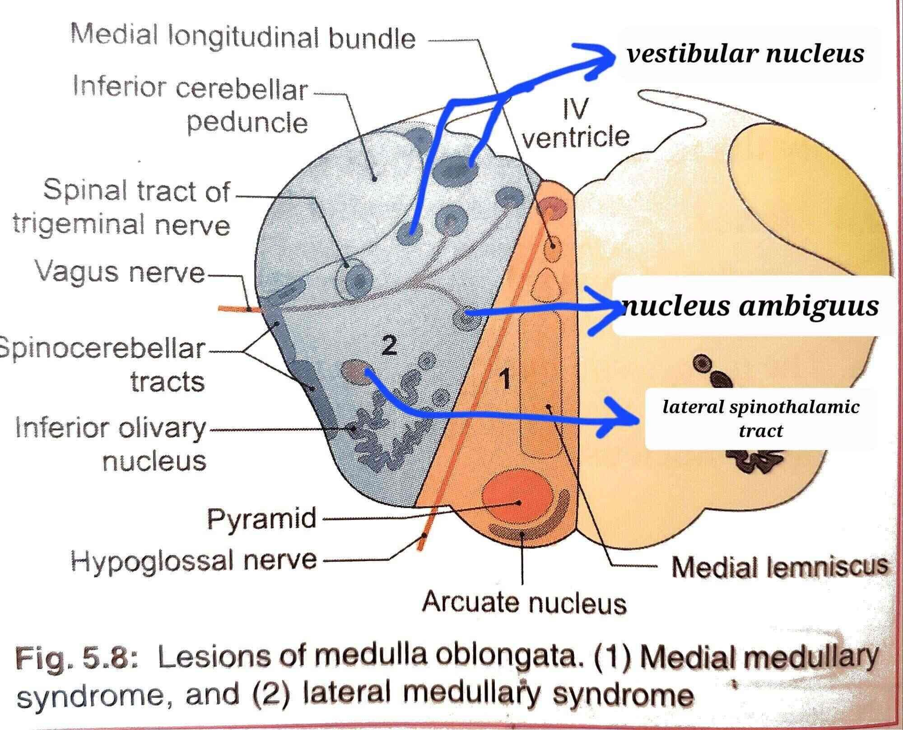

# Introduction
## Skills to Achieve

- Locate lesions (\*\*\*)
- Predict functional deficits (in addition to the ones mentioned in the vignette) (\*\*)
- Identify arteries involved (\*) (less important since most of the time these textbook syndromes occur due to tumours or other lesions, and rarely due to such well-targetedstrokes)

## Why?
To motivate the forthcoming study plan and the previously stated target skills, we'll take a look at a table differentiating between common brainstem stroke syndromes.

## Key Brainstem Syndromes Distilled

|  **Syndrome**  |                     **Region & Artery**                     |         **Cranial Nerves**         |                             **Key Features**                             |
| :------------: | :---------------------------------------------------------: | :--------------------------------: | :----------------------------------------------------------------------: |
|     Claude     |              Midbrain (red   nucleus), PCA               |               CN III               |                            i3 + contra ataxia                            |
|     Weber      | Midbrain (cerebral peduncle), Basilar (paramedian branches) |               CN III               |                        i3c7u + contra hemiparesis                        |
|    Parinaud    |  Midbrain (tectum), SCA & posterior choroidal (PCA branch)  |                 —                  |               Vertical gaze palsy, light-near dissociation               |
| Millard-Gubler |                Ventral pons, Basilar artery                 |           CN VI, CN VII            |                        i6, i7 + contra hemiplegia                        |
|   Wallenberg   |               Lateral  medulla,  PICA                | CN V (spinal nucleus), CN IX, CN X | Ipsi face pain/temp loss, contra body pain/temp loss, dysphagia, vertigo |
|    Dejerine    |           Medial medulla, Anterior spinal artery            |               CN XII               |               i12 + contra hemiplegia, proprioception loss               |

\newpage

# Skills-Oriented Study Plan
We have to master the following topics in order to hammer down the aforementioned skills:

- Know the **basic sensory and motor tracts** including their pathways and functions
	- Tracts:
		- Corticospinal
		- Spinothalamic
		- Dorsal column-medial lemniscal system (DCMLS)
		- Corticobulbar
	- Pathways: must know where each of these tracts
		- Decussate (if it does)
		- is located in
			- Cerebral cortex
			- Int. capsule
			- Midbrain
			- Pons
			- Medulla
			- Spinal cord
- Know the **locations of the cranial nerve nuclei**
- Know the clinically relevant **subdivisions** in **cross sections** of the different areas of the **brainstem**
- Know the **arterial supply** of the different parts

\newpage

# Tracts
## Corticospinal Tract
### Functions
- Convey all motor signals to voluntary muscles

### Pathway - Simplified
{ width=480pt }

### Pathway - Detailed

::: {#fig:myfig}
\begin{center}
\includegraphics[width=0.5\textwidth]{assets/20250501220751.png}
\end{center}
:::

## Spinothalamic tract
### Functions
- **Anterior**: 
	- Crude touch
	- Pressure
- **Lateral**: 
	- Pain
	- Temperature

### Pathway - Simplified
{ width=480pt }

\newpage

### Pathway - Detailed

#### Ventral Spinothalamic tract

::: {#fig:myfig}
\begin{center}
\includegraphics[width=0.5\textwidth]{assets/20250501221211.png}
\end{center}
:::

\newpage

#### Lateral Spinothalamic Tract

::: {#fig:myfig}
\begin{center}
\includegraphics[width=0.5\textwidth]{assets/20250501230618.png}
\end{center}
:::

\newpage
## Dorsal Column-Medial Lemniscus System (DCMLS)
### Functions
- Fine touch
- Vibration
- Proprioception

### Pathway - Simplified
{ width=480pt }

### Pathway - Detailed

::: {#fig:myfig}
\begin{center}
\includegraphics[width=0.5\textwidth]{assets/20250501221607.png}
\end{center}
:::

\newpage

# Midbrain

{ height=200pt }

## Region 1: Crus cerebri  (Weber's Syndrome)
(cerebral peduncle = crus anteriorly and tegmentum posteriorly)

- *Artery*: Ventral paramedian branches of PCA
- *Lesion*: **Weber's**
- Clinically relevant *structures:*
	- Corticospinal and corticobulbar fibres in the cerebral peduncles
	- Oculomotor nerve fibres exiting from interpeduncular fossa
- Clinical *syndrome*: **i3 + c7u + CHP**
	- Ipsilateral: Oculomotor palsy ("down and out")
	- Contralateral: UMN facial, hemiplegia

## Region 2: Tegmentum (Claude's Syndrome)
- *Artery*: Dorsal paramedian branches of PCA
- *Lesion*: **Claude's**
- Clinically relevant *structures*:
	- Red nucleus containing fibres from contralateral dentate nucleus of cerebellum (part of dentato-rubro-thalamic pathway)
	- Oculomotor nerve fibres in the central tegmental region
- Clinical *syndrome*: **i3 + CCAt**
	- Ipsilateral: Oculomotor palsy (CN3)
	- Contralateral: Cerebellar ataxia

\newpage

## Region 3: Tectum (Parinaud's Syndrome)
- *Artery*: Posterior choroidal artery (br. of PCA) at sup. colliculus, superior cerebellar artery (SCA) at inf. colliculus
- *Lesion*: **Parinaud's**
- Clinically relevant *structures*:
	- Interstitial nucleus of Cajal at superior colliculus aka rostral interstitial nucleus of the MLF (riMLF) which is the vertical gaze centre
	- Pretectal nucleus: relays light reflex input arm signals to Edinger-Westphal nucleus, which then relays it to oculomotor nucleus
- Clinical *syndrome*: 
	- Vertical gaze palsy (due to riMLF lesion)
	- Pupillary disorders (e.g. light-near dissociation) (due to pretectal nucleus lesion)

# Pons

{ height=200pt }

 
## Ventral (Basilar) Pons (Millard-Gubler Syndrome)
- *Artery*: Basilar artery (lodges in the median sulcus between the two sides of pons)
- *Lesion*: **Millard-Gubler's**
- Clinically relevant *structures*:
	- Corticospinal tract in the paramedian area
	- Axons of CN6 and CN7
- Clinical *syndrome*: ***i6, i7 + CHP*** 
	- Ipsilateral lateral rectus (CN6) and LMN facial palsy (CN7)
	- Contralateral hemiplegia

\newpage

# Medulla

{ height=200pt }

## Posterolateral Medulla (Wallenberg / lateral medullary syndrome)
- *Artery*: PICA (posteroinferior cerebellar artery, br. of vertebral)
- *Lesion*: **Wallenberg / lateral medullary syndrome**
- Clinically relevant *structures*:
	- Nucleus ambiguus: motor nucleus of CN 9, 10, 11 - ipsilateral soft palate, pharynx, larynx
	- Spinal trigeminal nucleus and tract: ipsilateral face - pain and temperature senses
	- Lateral spinothalamic tract: contralateral body - pain and temperature senses
	- Vestibular nucleus
	- Spinocerebellar tracts - coordinate ipsilateral limb movements
	- Descending sympathetic fibres from hypothalamus - ipsilateral Horner
- Clinical syndrome: ***i5, 9-11 + CPT***
	- Ipsilateral - 5 (pain and temperature lost at ipsilateral face), \[9, 10, 11\] (bulbar palsy) lesion; dysequilibrium (vestibular nucleus); ataxia (spinocerebellar tract); Horner's (ptosis, miosis, anhidrosis, enophthalmos)
	- Contralateral - pain and temperature lost (lateral spinothalamic) at contralateral body 

## Anteromedial Medulla (**Dejerine syndrome**)
- *Artery*: Anterior spinal artery
- *Lesion*: **Dejerine syndrome**
- Clinically relevant *structures*:
	- Pyramidal tract
	- Medial lemniscus
	- Hypoglossal nucleus and nerve
- Clinical *syndrome*: ***i12, dc + CHP***
	- Ipsilateral: fine touch, vibration (DCMLS); tongue paralysis (CN12)
	- Contralateral: hemiplegia (pyramidal)

\newpage

# High-Yield Summary

| **Region**               | **Artery**               | **Syndrome**   | **Key Features**                                        |
| ------------------------ | ------------------------ | -------------- | ------------------------------------------------------- |
| Midbrain (crus)          | PCA (ventral paramedian) | Weber’s        | i3 + contralateral hemiplegia + c7 UMN                  |
|                          |                          |                |                                                         |
| Midbrain (tegmentum)     | PCA (dorsal paramedian)  | Claude’s       | i3 + contralateral ataxia                               |
|                          |                          |                |                                                         |
| Midbrain (tectum)        | Post. choroidal, SCA     | Parinaud’s     | Vertical gaze palsy + pupillary light-near dissociation |
|                          |                          |                |                                                         |
| Pons (ventral)           | Basilar                  | Millard-Gubler | i6, i7 + contralateral hemiplegia                       |
|                          |                          |                |                                                         |
| Medulla (anteromedial)   | Anterior spinal          | Dejerine’s     | i12 + contralateral hemiplegia + DCMLS loss             |
|                          |                          |                |                                                         |
| Medulla (posterolateral) | PICA                     | Wallenberg     | i5, i9–11, Horner + contralateral pain/temp loss        |

