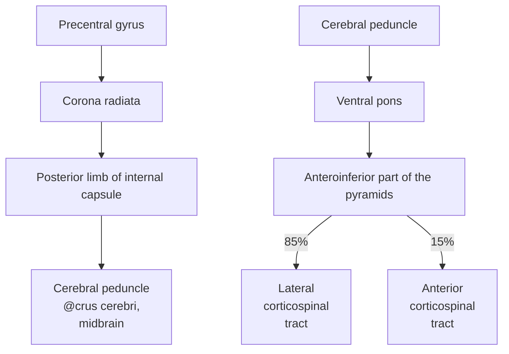
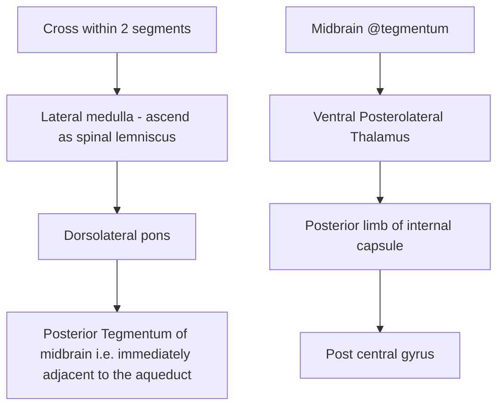
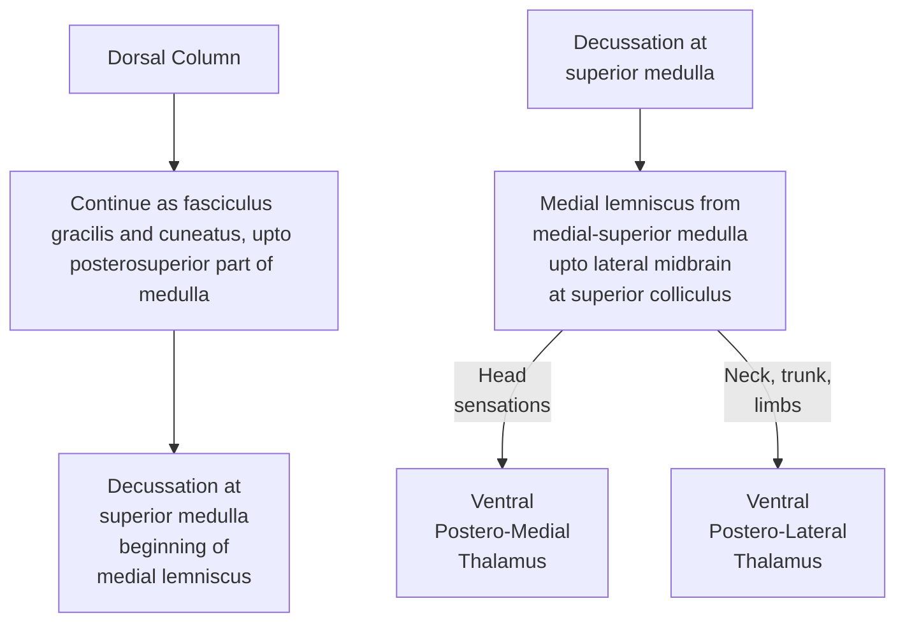

# Skills to Achieve
For commonly tested stroke variants, we have to
- Locate lesions (\*\*\*)
- Predict functional deficits (in addition to the ones mentioned in the vignette) (\*\*)
- Identify arteries involved (\*\*)
## Why?
To motivate the forthcoming study plan and the previously stated target skills, we'll take a look at a table differentiating between common brainstem stroke syndromes.

### Key Brainstem Syndromes Distilled

| **Syndrome**                | **Location**                                                               | **Artery**                                      | **CN(s) Involved**                        | **Tract(s) Involved**                                                                             | **Key Features**                                                                                                                      |
| --------------------------- | -------------------------------------------------------------------------- | ----------------------------------------------- | ----------------------------------------- | ------------------------------------------------------------------------------------------------- | ------------------------------------------------------------------------------------------------------------------------------------- |
| **Claude Syndrome**         | **Midbrain** (Red nucleus, superior cerebellar peduncle, CN III fascicles) | **Posterior cerebral artery (PCA)**             | **Oculomotor nerve (CN III)**             | **Corticospinal tract**, **Superior cerebellar peduncle**                                         | - **Contra hemiparesis**   - **Contra ataxia**   - **i3**                                                                       |
| **Weber Syndrome**          | **Midbrain** (Cerebral peduncle, CN III fascicles)                         | **Paramedian branches of basilar artery**       | **Oculomotor nerve (CN III)**             | **Corticospinal tract**                                                                           | - **Contra hemiparesis**   - **i3c7u**                                                                                             |
| **Parinaud Syndrome**       | **Midbrain** (Dorsal midbrain, tectum)                                     | **Superior cerebellar artery** (br. of basilar) | **None** (gaze center only)               | **Pretectal area**, **Vertical gaze center**                                                      | - **Paralysis of upgaze**   - **Light-near dissociation**   - **Eyelid retraction (Collier sign)**                              |
| **Millard-Gubler Syndrome** | **Pons** (Ventral pons, CN VI & VII fascicles)                             | **Basilar artery**                              | **Abducens (CN VI)**, **Facial (CN VII)** | **Corticospinal tract**                                                                           | -**Contra hemiparesis** - **i6, i7**                                                                                               |
| **Wallenberg Syndrome**     | **Medulla** ("Walls" of medulla = Lateral medulla)                         | **PICA**, **Vertebral artery**                  | **CN V nucleus**, **CN IX**, **CN X**     | **Spinothalamic tract**, **Spinal trigeminal tract**, **Vestibular nuclei**, **Nucleus ambiguus** | - **Ipsi facial pain/temp loss**   - **Contra body pain/temp loss**   - **Dysphagia, hoarseness**   - **Vertigo, nystagmus** |

# Skills-Oriented Study Plan
We have to master the following topics in order to hammer down the aforementioned skills:
- Know the **basic sensory and motor tracts** including their pathways and functions
	- Tracts:
		- Corticospinal
		- Spinothalamic
		- Dorsal column-medial lemniscal system (DCMLS)
		- Corticobulbar
	- Pathways: must know where each of these tracts
		- Decussate (if it does)
		- is located in
			- Cerebral cortex
			- Int. capsule
			- Midbrain
			- Pons
			- Medulla
			- Spinal cord
- Know the **locations of the cranial nerve nuclei**
- Know the anatomical and/or vascular supply-based **subdivisions** in **cross sections** of the different areas of the **brainstem**
	- Midbrain: Crus, tegmentum, tectum (from A to P)
	- Pons
	- Medulla
- Know the **arterial supply** of the different parts
# Tracts
## Corticospinal tract
### Functions
- Convey all motor signals to voluntary muscles
### Pathway

## Spinothalamic tract
### Functions
- **Anterior**: Crude touch, pressure
- **Lateral**: Pain, temperature
### Pathway

## DCMLS
### Functions
- Fine touch, vibration
### Pathway

# 🧠 Blood Supply of the Midbrain — Clinical Overview (Updated with Red Nucleus)

| Artery                        | Supplied Territory                             | Key Structures                                 | Clinical Correlates                             |
|------------------------------|-------------------------------------------------|------------------------------------------------|--------------------------------------------------|
| **Posterior Cerebral Artery** (PCA)   — paramedian & short circumferential branches | Anteromedial & medial tegmentum                | - **Cerebral peduncle**   - **Oculomotor nerve fascicles**   - **Substantia nigra**   - **Red nucleus** | **Weber syndrome** (CN III palsy + contralateral hemiparesis)   **Claude syndrome** (CN III palsy + contralateral ataxia/tremor)   **Benedikt syndrome** (CN III palsy + contralateral tremor + choreoathetosis) |
| **Quadrigeminal artery**   (branch of PCA) | Dorsal midbrain (tectum)                        | - **Superior & inferior colliculi**   - **Pretectal area** | **Parinaud syndrome** (upgaze palsy, light-near dissociation, convergence-retraction nystagmus) |
| **Posterior choroidal arteries** (PCA branches) | Posterior/dorsal midbrain + thalamus           | - Pretectum   - Pineal region structures   - Thalamic pulvinar | Can contribute to **Parinaud syndrome** or **thalamic syndromes** |
| **Superior Cerebellar Artery** (SCA) | Lateral & inferior midbrain, esp. caudal tectum | - Inferior colliculus   - Superior cerebellar peduncle   - Decussation of dentatorubrothalamic fibers | May overlap in **Claude syndrome** (via cerebellar pathways)   Rarely contributes to **Parinaud** if inferior colliculus involved |
| **Basilar artery (top end)** | Ventral midbrain                                 | - Basis pedunculi   - CN III rootlets       | Can cause **Weber-like syndromes** due to overlap with PCA territory |

---

### 🧠 Named Midbrain Stroke Syndromes (Refreshed)

| Syndrome          | Lesion Site                              | Artery Involved             | Key Features                                       |
|------------------|------------------------------------------|-----------------------------|----------------------------------------------------|
| **Weber**        | Cerebral peduncle + CN III fascicles      | PCA (paramedian branch)     | CN III palsy + contralateral hemiplegia            |
| **Claude**       | **Red nucleus** + CN III fascicles        | PCA (paramedian) ± SCA      | CN III palsy + contralateral ataxia/tremor         |
| **Benedikt**     | Red nucleus + **medial tegmentum**        | PCA (paramedian)            | CN III palsy + contralateral tremor + athetosis    |
| **Parinaud**     | **Pretectal area** and **superior colliculi** | Quadrigeminal / Posterior choroidal | Vertical gaze palsy, convergence-retraction nystagmus, light-near dissociation |

---

💡 **Clinical Insight**:  
If a patient has **CN III palsy + contralateral cerebellar signs (ataxia, tremor)** → suspect **red nucleus involvement** = **Claude or Benedikt syndrome** → Think **PCA (paramedian branches)** ± **SCA** if cerebellar fibers are more involved.

# 🧠 Brainstem Blood Supply — Medulla & Pons

---

## 🧠 MEDULLA

| Artery                          | Supplied Territory                      | Key Structures                                                                 | Clinical Syndromes                                      |
|---------------------------------|------------------------------------------|---------------------------------------------------------------------------------|----------------------------------------------------------|
| **Anterior spinal artery**      | Anteromedial medulla                     | - Pyramids (corticospinal tract)   - Medial lemniscus   - CN XII nucleus/fascicles | **Medial medullary syndrome (Dejerine)** —Contralateral hemiparesis —Contralateral proprioception loss —Ipsilateral tongue weakness |
| **Posterior inferior cerebellar artery (PICA)** | Lateral medulla                        | - Spinothalamic tract   - Spinal trigeminal nucleus   - Vestibular nuclei   - Nucleus ambiguus   - Inferior cerebellar peduncle | **Lateral medullary syndrome (Wallenberg)** —Dysphagia, hoarseness —Contralateral body pain/temp loss —Ipsilateral face pain/temp loss —Vertigo, nystagmus, ataxia |
| **Vertebral artery** (direct branches) | Lateral & ventrolateral medulla        | Often overlaps with PICA territory; supplies similar areas                       | Can mimic Wallenberg; large infarcts may affect both medial & lateral areas |

---

## 🧠 PONS

| Artery                              | Supplied Territory                    | Key Structures                                                                 | Clinical Syndromes                                      |
|-------------------------------------|----------------------------------------|---------------------------------------------------------------------------------|----------------------------------------------------------|
| **Paramedian branches of basilar artery** | Anteromedial pons                     | - Corticospinal tract   - Medial lemniscus   - CN VI nucleus/fascicles   - CN VII fascicles (sometimes) | **Medial pontine syndrome (Foville or Raymond)** —Contralateral hemiparesis —Contralateral vibration/proprioception loss —Ipsilateral CN VI or VII palsy |
| **Short circumferential branches (basilar)** | Anterolateral pons                   | - Middle cerebellar peduncle   - Pontine nuclei   - CN V motor/sensory roots | Rarely isolated infarcts; may contribute to **ataxia, facial weakness** |
| **Long circumferential branches (AICA)** | Lateral caudal pons                  | - Spinothalamic tract   - Spinal trigeminal nucleus   - Vestibular nuclei   - CN VII nucleus/fibers   - Inferior cerebellar peduncle | **Lateral pontine syndrome (AICA infarct)** —Facial paralysis —Hearing loss —Vertigo, nausea —Contralateral pain/temp loss |
| **Superior cerebellar artery (SCA)** | Dorsolateral rostral pons + cerebellum | - Superior cerebellar peduncle   - Lateral lemniscus   - Cerebellar structures | May cause **ataxia**, dysmetria, contralateral sensory changes; overlaps with midbrain in some infarcts |

---

## 🧠 Summary of Named Brainstem Syndromes

| Syndrome                 | Level     | Territory Affected           | Artery                       | Key Features |
|--------------------------|-----------|-------------------------------|------------------------------|--------------|
| **Medial medullary (Dejerine)** | Medulla   | Anteromedial                  | Anterior spinal              | Hemiparesis, proprioception loss, tongue deviation |
| **Lateral medullary (Wallenberg)** | Medulla   | Lateral                       | PICA                         | Dysphagia, ataxia, Horner's, pain/temp loss        |
| **Medial pontine (Foville/Raymond)** | Pons      | Anteromedial                  | Paramedian basilar           | CN VI/ VII palsy, hemiparesis                      |
| **Lateral pontine (AICA)**        | Pons      | Lateral caudal                | AICA                         | CN VII palsy, vertigo, hearing loss, ataxia        |

---

🧠 **Key Clinical Pearls**:
- Medial = **motor** → corticospinal tract + CN nuclei → hemiparesis + cranial nerve palsy.
- Lateral = **sensory + cerebellar + autonomic** → ataxia, vertigo, Horner’s, dissociated sensory loss.
- CN localization helps determine level:  
  - CN XII = medulla  
  - CN VI/VII = pons  
  - CN III = midbrain

