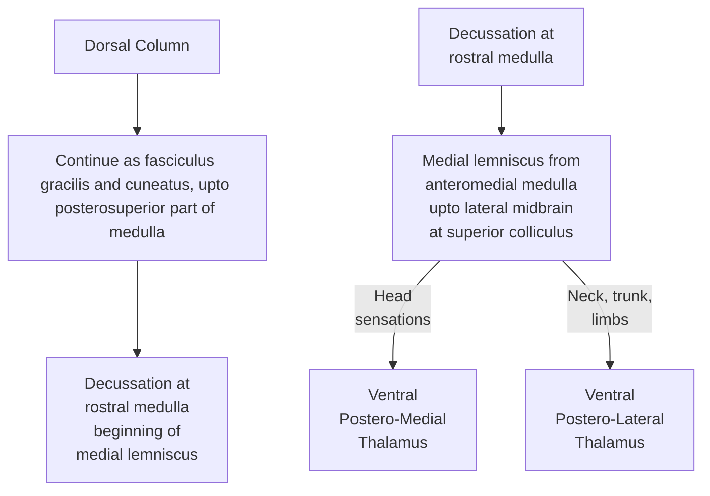

# Skills to Achieve
For commonly tested stroke variants, we have to
- Locate lesions (\*\*\*)
- Predict functional deficits (in addition to the ones mentioned in the vignette) (\*\*)
- Identify arteries involved (\*) (less important since most of the time these textbook syndromes occur due to tumours or other lesions, and rarely due to such well-targetedstrokes)
## Why?
To motivate the forthcoming study plan and the previously stated target skills, we'll take a look at a table differentiating between common brainstem stroke syndromes.

### Key Brainstem Syndromes Distilled

| **Syndrome**                | **Location**                                                               | **Artery**                                      | **CN(s) Involved**                        | **Tract(s) Involved**                                                                             | **Key Features**                                                                                                                      |
| --------------------------- | -------------------------------------------------------------------------- | ----------------------------------------------- | ----------------------------------------- | ------------------------------------------------------------------------------------------------- | ------------------------------------------------------------------------------------------------------------------------------------- |
| **Claude Syndrome**         | **Midbrain** (Red nucleus, superior cerebellar peduncle, CN III fascicles) | **Posterior cerebral artery (PCA)**             | **Oculomotor nerve (CN III)**             | **Corticospinal tract**, **Superior cerebellar peduncle**                                         | - **Contra hemiparesis**   - **Contra ataxia**   - **i3**                                                                       |
| **Weber Syndrome**          | **Midbrain** (Cerebral peduncle, CN III fascicles)                         | **Paramedian branches of basilar artery**       | **Oculomotor nerve (CN III)**             | **Corticospinal tract**                                                                           | - **Contra hemiparesis**   - **i3c7u**                                                                                             |
| **Parinaud Syndrome**       | **Midbrain** (Dorsal midbrain, tectum)                                     | **Superior cerebellar artery** (br. of basilar) | **None** (gaze center only)               | **Pretectal area**, **Vertical gaze center**                                                      | - **Paralysis of upgaze**   - **Light-near dissociation**   - **Eyelid retraction (Collier sign)**                              |
| **Millard-Gubler Syndrome** | **Pons** (Ventral pons, CN VI & VII fascicles)                             | **Basilar artery**                              | **Abducens (CN VI)**, **Facial (CN VII)** | **Corticospinal tract**                                                                           | -**Contra hemiparesis** - **i6, i7**                                                                                               |
| **Wallenberg Syndrome**     | **Medulla** ("Walls" of medulla = Lateral medulla)                         | **PICA**, **Vertebral artery**                  | **CN V nucleus**, **CN IX**, **CN X**     | **Spinothalamic tract**, **Spinal trigeminal tract**, **Vestibular nuclei**, **Nucleus ambiguus** | - **Ipsi facial pain/temp loss**   - **Contra body pain/temp loss**   - **Dysphagia, hoarseness**   - **Vertigo, nystagmus** |

# Skills-Oriented Study Plan
We have to master the following topics in order to hammer down the aforementioned skills:
- Know the **basic sensory and motor tracts** including their pathways and functions
	- Tracts:
		- Corticospinal
		- Spinothalamic
		- Dorsal column-medial lemniscal system (DCMLS)
		- Corticobulbar
	- Pathways: must know where each of these tracts
		- Decussate (if it does)
		- is located in
			- Cerebral cortex
			- Int. capsule
			- Midbrain
			- Pons
			- Medulla
			- Spinal cord
- Know the **locations of the cranial nerve nuclei**
- Know the anatomical and/or vascular supply-based **subdivisions** in **cross sections** of the different areas of the **brainstem**
	- Midbrain: Crus, tegmentum, tectum (from A to P)
	- Pons
	- Medulla
- Know the **arterial supply** of the different parts
# Tracts
## Corticospinal tract
### Functions
- Convey all motor signals to voluntary muscles
### Pathway - Simplified

### Pathway - Detailed
![[assets/Pasted image 20250501132124.png]]
## Spinothalamic tract
### Functions
- **Anterior**: Crude touch, pressure
- **Lateral**: Pain, temperature
### Pathway - Simplified

### Pathway - Detailed
![[assets/Pasted image 20250501131802.png]]
![[assets/Pasted image 20250501131857.png]]

## DCMLS
### Functions
- Fine touch, vibration
### Pathway - Simplified

### Pathway - Detailed
![[assets/Pasted image 20250501131647.png]]

# Sensory pathways - general organisation
![[assets/Pasted image 20250501132016.png]]

# Blood Supply of the Brain - Circle of Willis
![[assets/Pasted image 20250501154425.png]]

---
## Cranial Nerve Nuclei
![[assets/Pasted image 20250501132710.png]]
![[assets/Pasted image 20250501132936.png]]

## 🧠 Brainstem Blood Supply — Medulla & Pons

---

### 🧠 MEDULLA

| Artery                          | Supplied Territory                      | Key Structures                                                                 | Clinical Syndromes                                      |
|---------------------------------|------------------------------------------|---------------------------------------------------------------------------------|----------------------------------------------------------|
| **Anterior spinal artery**      | Anteromedial medulla                     | - Pyramids (corticospinal tract)   - Medial lemniscus   - CN XII nucleus/fascicles | **Medial medullary syndrome (Dejerine)** —Contralateral hemiparesis —Contralateral proprioception loss —Ipsilateral tongue weakness |
| **Posterior inferior cerebellar artery (PICA)** | Lateral medulla                        | - Spinothalamic tract   - Spinal trigeminal nucleus   - Vestibular nuclei   - Nucleus ambiguus   - Inferior cerebellar peduncle | **Lateral medullary syndrome (Wallenberg)** —Dysphagia, hoarseness —Contralateral body pain/temp loss —Ipsilateral face pain/temp loss —Vertigo, nystagmus, ataxia |
| **Vertebral artery** (direct branches) | Lateral & ventrolateral medulla        | Often overlaps with PICA territory; supplies similar areas                       | Can mimic Wallenberg; large infarcts may affect both medial & lateral areas |

---

## 🧠 Summary of Named Brainstem Syndromes

| Syndrome                 | Level     | Territory Affected           | Artery                       | Key Features |
|--------------------------|-----------|-------------------------------|------------------------------|--------------|
| **Medial medullary (Dejerine)** | Medulla   | Anteromedial                  | Anterior spinal              | Hemiparesis, proprioception loss, tongue deviation |
| **Lateral medullary (Wallenberg)** | Medulla   | Lateral                       | PICA                         | Dysphagia, ataxia, Horner's, pain/temp loss        |
| **Medial pontine (Foville/Raymond)** | Pons      | Anteromedial                  | Paramedian basilar           | CN VI/ VII palsy, hemiparesis                      |
| **Lateral pontine (AICA)**        | Pons      | Lateral caudal                | AICA                         | CN VII palsy, vertigo, hearing loss, ataxia        |

---

🧠 **Key Clinical Pearls**:
- Medial = **motor** → corticospinal tract + CN nuclei → hemiparesis + cranial nerve palsy.
- Lateral = **sensory + cerebellar + autonomic** → ataxia, vertigo, Horner’s, dissociated sensory loss.
- CN localization helps determine level:  
  - CN XII = medulla  
  - CN VI/VII = pons  
  - CN III = midbrain

